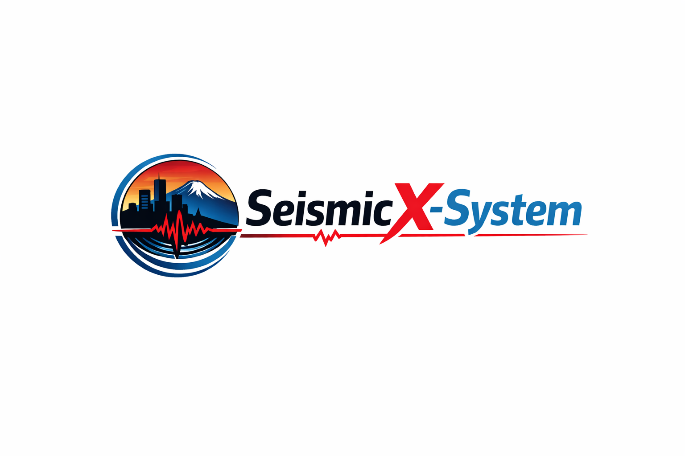

<p align="center">
  
</p>


# SeismoX System

*A Unified System for Probabilistic Seismic Monitoring and Intelligent Waveform Processing*


## Overview

**SeismoX System** (also referred to as **SeismicX-System**) is an integrated research-to-production seismic monitoring platform that combines **deep learning**, **Bayesian inference**, and **real-time data streaming** for earthquake detection, association, location, and uncertainty-aware analysis.

The system is designed to bridge the gap between **cutting-edge seismological research** and **operational seismic monitoring**, enabling reproducible scientific workflows while remaining scalable to real-time regional or national deployments.


## Related Research and Publications

SeismoX System is built upon and validated by a series of peer-reviewed and preprint research works covering **phase picking**, **earthquake location**, **focal mechanism determination**, and **uncertainty estimation** in seismology.

### 1. Bayesian Earthquake Location with Neural Travel-Time Surrogates

**Bayesian Earthquake Location with a Neural Travel-Time Surrogate:
Fast, Robust, and Fully Probabilistic Inference in 3-D Media**

* **Authors**: Jinqing Sun, Ziye Yu, Zemin Liu, Lu Li, Chunyu Liu, Wei Yang, Yuqi Cai
* **arXiv**: arXiv:2512.06407
* **Category**: physics.geo-ph
* **Submitted**: 6 December 2025
* **Comments**: 15 pages, 7 figures

**Abstract (summary)**
This work presents a fully probabilistic earthquake location framework that couples a deep-learning travel-time surrogate with Gibbs sampling. The surrogate is trained to satisfy the Eikonal equation and reproduces the full 3-D first-arrival travel-time field, eliminating expensive ray tracing. The framework enables fast, robust, and uncertainty-aware hypocenter estimation in complex 3-D media.

**Relevance to SeismoX**
This paper provides the theoretical foundation for the **probabilistic location module** in SeismoX System.


### 2. Deep-Learning-Based Focal Mechanism Determination

**A Deep-Learning-Based Framework for Focal Mechanism Determination and Its Application to the 2022 Luding Earthquake Sequence**

* **Authors**: Ziye Yu, Yuqi Cai
* **arXiv**: arXiv:2511.19185
* **Category**: physics.geo-ph
* **Submitted**: 24 November 2025
* **Comments**: 11 pages, 7 figures

**Abstract (summary)**
This study develops an automated focal mechanism determination framework based on deep learning and P-wave first-motion polarities, enabling reliable mechanism solutions for small-to-moderate earthquakes (M ≤ 4.5). The framework is applied to the 2022 Luding earthquake sequence.

**Relevance to SeismoX**
This work supports the **automated focal-mechanism module** and downstream tectonic interpretation capabilities.

---

### 3. Nationwide Pg/Sg/Pn/Sn Phase Picking (Journal Article)

**A Deep Learning Framework for Pg/Sg/Pn/Sn Phase Picking and Its Nationwide Implementation in Chinese Mainland**

* **Journal**: *Journal of Geophysical Research: Machine Learning and Computation*
* **Authors**: Ziye Yu *et al.*
* **DOI**: 10.1029/2025JH000944
* **Article ID**: JGR170175

This paper presents a deep-learning framework for robust Pg/Sg/Pn/Sn phase picking and demonstrates its nationwide deployment.

**Relevance to SeismoX**
Forms the **core phase-picking engine** used by the SeismoX real-time pipeline.


### 4. SeismicXM Foundation Model (SRL, Accepted)

**SeismicXM: A Cross-Task Foundation Model for Single-Station Seismic Waveform Processing**

* **Journal**: *Seismological Research Letters (SRL)*
* **Status**: Accepted

This work introduces **SeismicXM**, a foundation model supporting multiple seismic waveform tasks.

**Relevance to SeismoX**
Provides the conceptual basis for **cross-task, reusable deep models** integrated into the system.


### 5. Uncertainty Estimation for Rayleigh Wave Dispersion

**A Framework for Uncertainty Estimation in Seismology Data Processing with Application to Extract Rayleigh Wave Dispersion Curves from Noise Cross-correlation Functions**

* **Authors**: Ziye Yu, Xin Liu
* **arXiv**: arXiv:2503.20460
* **DOI**: [https://doi.org/10.48550/arXiv.2503.20460](https://doi.org/10.48550/arXiv.2503.20460)
* **Category**: physics.geo-ph

This work proposes a probabilistic framework for uncertainty estimation in manually labeled seismic data and applies it to Rayleigh wave dispersion extraction from noise cross-correlation functions.

**Relevance to SeismoX**
Supports **uncertainty-aware inference and posterior modeling** across SeismoX workflows.

---

## System Description

### What is SeismoX System?

SeismoX System is a **runnable prototype for a regional real-time seismic catalog**, designed with a **streaming-first architecture** (Kafka/Flink-ready) while remaining usable as a **single-process FastAPI service** for research, testing, and demonstration.

It supports ingestion, detection, association, location, storage, and visualization within a unified framework.

## Implemented Features

* Station management API with geospatial metadata and health status.
* Automatic IRIS station discovery and import.
* Waveform ingestion via Base64 MiniSEED payloads.
* Asynchronous real-time processing pipeline:

  * Pg/Sg/Pn/Sn phase picking
  * Simple association
  * Event location and magnitude estimation
* Event and pick browsing APIs.
* Leaflet + OpenStreetMap interactive event dashboard.
* IRIS SeedLink real-time waveform ingest and visualization.
* Health endpoint exposing live queue depth and service status.


## Quickstart

### Install Dependencies

```bash
pip install -r requirements.txt
```

### Run the API

```bash
uvicorn app.main:app --reload --host 0.0.0.0 --port 8000
```

### Open Dashboard

Visit:
`http://localhost:8000/`

API documentation is available at `/docs`.


## Design Notes

* **Processing Pipeline**: Async queue-based worker architecture.
* **Storage**:

  * Waveforms: `app/data/waveforms/`
  * Catalog: `app/data/catalog.db` (SQLite)
* **Extensibility**:

  * Replace internal logic with real pickers, associators, or Kafka/Flink streaming backends.
* **Resilience**:

  * Async processing
  * Health and queue metrics exposed via API.


## Project Status

SeismoX System is a **functional single-node demonstration platform** with stubbed association and location logic.
It is intended as a **research-grade reference implementation** that can be scaled to production by integrating external streaming systems and high-fidelity seismic models.


## Contact

For questions, collaboration, or integration inquiries:

**[caiyuqiming@163.com](mailto:caiyuqiming@163.com)**
